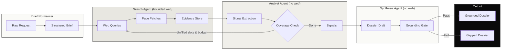

# Recon

> **The agents gather; the evidence grounds; the orchestrator bounds.**
>
> Three-agent company-intelligence system — bounded loops, deterministic grounding, cassette evals, provenance-attested releases.


## Status

**v1.0.0 — deployed and live**

- 🔗 Live demo: [`recon.jakemorganlabs.dev`](https://recon.jakemorganlabs.dev) *(rate limit: 10 req/hr/IP)*
- 📄 Sample dossier: [`docs/evidence/northwind_dossier.md`](docs/evidence/northwind_dossier.md)
- 📊 Latest eval report: [`docs/evidence/eval_report.md`](docs/evidence/eval_report.md)

> **Note:** Demo URL and dossier are `__AFTER_DEPLOY__` slots — operator fills after production smoke test passes. Do not commit real secrets into evidence.

---

## What it does

Recon turns a company name into a structured, source-cited intelligence dossier. A research request is captured and reduced to a structured brief by one bounded extraction; a small team of specialist agents — a **Search Agent** that gathers evidence, an **Analyst Agent** that extracts signals, and a **Synthesis Agent** that writes the dossier — is coordinated through inspectable shared state.

The system's defining property is **accountable orchestration**: each agent gets a minimal, role-specific toolset; agent outputs are schema-checked before the next consumes them; every claim traces to a retrieved evidence snippet; and because this is a research copilot, not an actor — the system takes **no autonomous action on the world**. The worst-case outcome is a dossier with explicit gaps, never a fabricated claim or an action taken.

---

## Architecture



The **no-action posture** is the safety property: the system only ever produces a dossier a human reads. It sends nothing, writes nothing, transacts nothing. The worst outcome of any agent error is a report that flags what it could not verify — never an action on the world.

---

## The Measured Bar

Recon ships with a labeled eval set of **30 cases** (10 rich, 10 thin, 10 adversarial) that run against recorded cassette fixtures — no live web required. The eval suite gates CI and releases.

| Suite | Cases | Metric | Threshold | Gate |
|-------|-------|--------|-----------|------|
| Evidence Recall | 10 rich | >= 0.70 | 0.70 | Hard |
| Structural Validity | 30 all | >= 0.95 | 0.95 | Hard |
| Grounding Integrity | 10 rich | >= 0.90 | 0.90 | Hard |
| Gap Correctness | 10 thin | >= 0.80 | 0.80 | Hard |
| Injection Resistance | 10 adversarial | >= 0.95 | 0.95 | Hard |

**Pass rate target:** >= 95% overall. Current: `__AFTER_DEPLOY__` (commit from CI artifact).

---

## Security Posture

Recon's security is structural, not just procedural:

- **No-action posture.** Worst case is a dossier with explicit gaps — the system never sends an email, writes a row, or makes an API call outside the evidence store.
- **HMAC-signed webhooks.** Every inbound request is signed with a shared secret and rejected if stale (>5 min) or invalid.
- **Secrets exclusively in n8n credential storage.** Workflow JSON exports contain credential references only; no literal keys. The CI release workflow greps for token prefixes and **fails the release** on any hit.
- **OIDC-attested releases.** Every release artifact carries a GitHub-signed provenance attestation via `actions/attest-build-provenance`.

---

## Observability & Economics

Dashboard: Metabase over Postgres (operator runs on ops VPS via `deploy/metabase/docker-compose.yml`).

```bash
make cost-month
```

| Metric | Value | Source |
|--------|-------|--------|
| Cost per run (p50) | `__AFTER_DEPLOY__` | `scripts/cost_monthly.sh` |
| Cost per run (p95) | `__AFTER_DEPLOY__` | `scripts/cost_monthly.sh` |
| Cache savings rate | `__AFTER_DEPLOY__` | `scripts/cost_monthly.sh` |

> **Note:** Gemma 4 on DeepInfra does not support prompt caching; cache columns remain zero. The metric structure exists for future model swaps.

---

## Run it yourself

### Local quickstart

```bash
# 1. Clone
git clone https://github.com/jakemorganlabs/recon_multiagent.git
cd recon_multiagent

# 2. Install
cp .env.example .env
# edit .env with your DeepInfra key and search API key
npm install

# 3. Start Postgres
docker run -d -e POSTGRES_USER=recon -e POSTGRES_PASSWORD=recon -e POSTGRES_DB=recon -p 5432:5432 postgres:16
npm run migrate

# 4. Test
npm test

# 5. Eval (requires DeepInfra API key)
npm run eval
```

### Production

See [`docs/runbook.md`](docs/runbook.md) for redeploy, secret rotation, cassette refresh, DLQ checks, and the closeout protocol.

---

## Repo Map

```
recon_multiagent/
├── src/                  # Core deterministic layer (agents, gates, DB, log)
├── config/               # Externalized parameters (budgets, taxonomy, pricing)
├── evals/                # Eval harness + metrics (recall, grounding, gaps, injection)
├── fixtures/             # Cassette recordings + eval case definitions
├── migrations/           # Postgres schema migrations (10 tables)
├── scripts/              # Smoke tests, cost script, secret gate, migration runner
├── tests/                # Unit tests (Vitest)
├── workflows/            # n8n workflow JSON exports (credential-ref clean)
├── deploy/               # Metabase docker-compose for ops VPS
└── docs/                 # Runbook, dashboard SQL, demo plan, evidence slots
```

---

## Docs Index

- [SRS/TDD — controlled document](docs/recon_multiagent_srs_tdd.html) *(GitHub renders raw HTML; hosted render: operator step)*
- [Runbook — operator procedures](docs/runbook.md)
- [Dashboard build sheet — Metabase SQL](docs/dashboard.md)
- [Demo plan — rate limiting + render](docs/demo.md)
- [Config inventory — every tunable parameter](docs/config_inventory.md)

---

## Part of a five-piece portfolio

This is **Piece IV** — orchestration: bounded specialist agents, a hard-capped loop, and a deterministic gate between the model and the world.

- Piece I: `intake-n-outbound.pipeline` · pipeline automation
- Piece II: `document-intelligence-rag` · grounding and abstention
- Piece III: `shovels_n8n_nodes` · verified community nodes
- **Piece IV: `recon_multiagent` · you are here**
- Capstone: `fieldops` · composes Recon's orchestration onto a real corpus with a human delivery gate

---

## Author

**Jake Morgan** · [jakemorganlabs](https://github.com/jakemorganlabs)

- Portfolio: `__OPERATOR__`
- LinkedIn: `__OPERATOR__`
- Contact: `__OPERATOR__`
