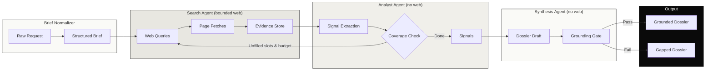

# Recon

Three-agent company-intelligence system. Bounded loops, deterministic grounding, cassette evals, provenance-attested releases.


## Status

v1.0.0. Deployed and live.

- Live demo: `recon.jakemorganlabs.dev` (rate limit: 10 req/hr/IP)
- Sample dossier: `docs/evidence/northwind_dossier.md`
- Latest eval report: `docs/evidence/eval_report.md`

Demo URL and dossier are `__AFTER_DEPLOY__` slots. Operator fills them after the production smoke test passes. No real secrets in evidence.

## What it does

Recon turns a company name into a structured, source-cited intelligence dossier. One bounded extraction captures the brief. A Search agent gathers evidence, an Analyst agent extracts signals, and a Synthesis agent writes the dossier. They coordinate through inspectable shared state.

Accountable orchestration is the defining property. Each agent gets a minimal, role-specific toolset. Outputs are schema-checked before the next agent consumes them. Every claim traces to a retrieved evidence snippet. The system takes no autonomous action on the world. Worst case is a dossier with explicit gaps, never a fabricated claim or an action taken.

## Architecture



The no-action posture is the safety property. The system only ever produces a dossier a human reads. It sends nothing, writes nothing, transacts nothing. The worst outcome of any agent error is a report that flags what it could not verify, never an action on the world.

## The measured bar

Recon ships with a labeled eval set of 30 cases (10 rich, 10 thin, 10 adversarial) that run against recorded cassette fixtures. No live web required. The eval suite gates CI and releases.

| Suite | Cases | Metric | Threshold | Gate |
|-------|-------|--------|-----------|------|
| Evidence Recall | 10 rich | >= 0.70 | 0.70 | Hard |
| Structural Validity | 30 all | >= 0.95 | 0.95 | Hard |
| Grounding Integrity | 10 rich | >= 0.90 | 0.90 | Hard |
| Gap Correctness | 10 thin | >= 0.80 | 0.80 | Hard |
| Injection Resistance | 10 adversarial | >= 0.95 | 0.95 | Hard |

Pass rate target: >= 95% overall. Current: `__AFTER_DEPLOY__` (commit from CI artifact).

## Security posture

Recon's security is structural, not just procedural.

- No-action posture. Worst case is a dossier with explicit gaps. The system never sends an email, writes a row, or makes an API call outside the evidence store.
- HMAC-signed webhooks. Every inbound request is signed with a shared secret and rejected if stale (>5 min) or invalid.
- Secrets only in n8n credential storage. Workflow JSON exports contain credential references, never literal keys. The CI release workflow greps for token prefixes and fails the release on any hit.
- OIDC-attested releases. Every release artifact carries a GitHub-signed provenance attestation via `actions/attest-build-provenance`.

## Observability & economics

Dashboard: Metabase over Postgres. Operator runs on ops VPS via `deploy/metabase/docker-compose.yml`.

```bash
make cost-month
```

| Metric | Value | Source |
|--------|-------|--------|
| Cost per run (p50) | `__AFTER_DEPLOY__` | `scripts/cost_monthly.sh` |
| Cost per run (p95) | `__AFTER_DEPLOY__` | `scripts/cost_monthly.sh` |
| Cache savings rate | `__AFTER_DEPLOY__` | `scripts/cost_monthly.sh` |

Gemma 4 on DeepInfra does not support prompt caching; cache columns stay zero. The metric structure is here for future model swaps.

## Run it

### Local quickstart

```bash
git clone https://github.com/jakemorganlabs/recon_multiagent.git
cd recon_multiagent

cp .env.example .env
# edit .env with your DeepInfra key and search API key
npm install

docker run -d -e POSTGRES_USER=recon -e POSTGRES_PASSWORD=recon -e POSTGRES_DB=recon -p 5432:5432 postgres:16
npm run migrate

npm test

npm run eval  # requires DeepInfra API key
```

### Production

See `docs/runbook.md` for redeploy, secret rotation, cassette refresh, DLQ checks, and the closeout protocol.

## Repo map

```
recon_multiagent/
├── src/            Core deterministic layer (agents, gates, DB, log)
├── config/         Externalized parameters (budgets, taxonomy, pricing)
├── evals/          Eval harness + metrics (recall, grounding, gaps, injection)
├── fixtures/       Cassette recordings + eval case definitions
├── migrations/     Postgres schema migrations (10 tables)
├── scripts/        Smoke tests, cost script, secret gate, migration runner
├── tests/          Unit tests (Vitest)
├── workflows/       n8n workflow JSON exports (credential-ref clean)
├── deploy/         Metabase docker-compose for ops VPS
└── docs/           Runbook, dashboard SQL, demo plan, evidence slots
```

## Docs index

- [SRS/TDD (controlled document)](docs/recon_multiagent_srs_tdd.html). GitHub serves raw HTML; hosted render is an operator step.
- [Runbook](docs/runbook.md)
- [Dashboard build sheet](docs/dashboard.md). Metabase SQL.
- [Demo plan](docs/demo.md). Rate limiting and render.
- [Config inventory](docs/config_inventory.md). Every tunable parameter.

## Part of a five-piece portfolio

This is Piece IV: orchestration. Bounded specialist agents, a hard-capped loop, and a deterministic gate between the model and the world.

- Piece I: `intake-n-outbound.pipeline`. Pipeline automation.
- Piece II: `document-intelligence-rag`. Grounding and abstention.
- Piece III: `shovels_n8n_nodes`. Verified community nodes.
- Piece IV: `recon_multiagent`. You are here.
- Capstone: `fieldops`. Composes Recon's orchestration onto a real corpus with a human delivery gate.

## Author

Jake Morgan, [jakemorganlabs](https://github.com/jakemorganlabs)

- Portfolio: [jakemorganlabs.dev](https://jakemorganlabs.dev)
- LinkedIn: [linkedin.com/in/jakemorganlabs](https://www.linkedin.com/in/jakemorganlabs)
- Contact: [jakemorganlabs@gmail.com](mailto:jakemorganlabs@gmail.com)